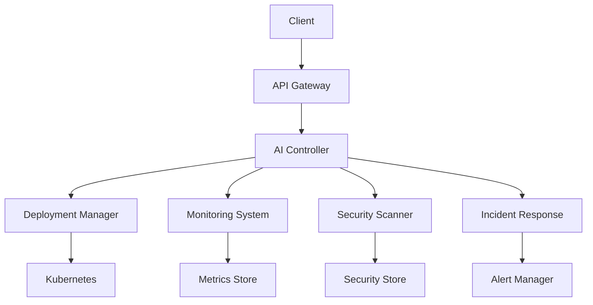

# AI DevOps System Documentation

## Table of Contents

1. [Overview](#overview)
2. [Getting Started](#getting-started)
3. [Architecture](#architecture)
4. [Components](#components)
5. [Configuration](#configuration)
6. [APIs](#apis)
7. [Best Practices](#best-practices)
8. [Troubleshooting](#troubleshooting)
9. [Contributing](#contributing)

## Overview

The AI DevOps System is an intelligent automation platform that enhances DevOps workflows using artificial intelligence and machine learning. The system provides automated deployment management, intelligent monitoring, security scanning, and incident response capabilities.

### Key Features

- AI-powered deployment strategies
- Intelligent monitoring and anomaly detection
- Automated security scanning
- ML-based incident classification and response
- Performance analytics and optimization
- Automated reporting and visualization

### System Requirements

- Python 3.9+
- Kubernetes 1.24+
- Minimum 8GB RAM
- 4 CPU cores
- 100GB storage

## Getting Started

### Installation

```bash
# Clone the repository
git clone https://github.com/alolo/ai_automated_devops

# Install dependencies
pip install -r requirements.txt

# Configure the system
cp config/config.example.yaml config/config.yaml
```

### Quick Start

1. Configure your environment:
```bash
export AIDEVOPS_ENV=production
export AIDEVOPS_CONFIG_PATH=/path/to/config.yaml
```

2. Initialize the system:
```bash
python -m aidevops init
```

3. Start the services:
```bash
python -m aidevops start
```

## Architecture

### High-Level Architecture



### Component Interactions

1. **AI Controller**
   - Coordinates all AI-powered operations
   - Manages component communication
   - Handles decision making

2. **Data Flow**
   - Metrics collection → Analysis → Decision → Action
   - Continuous feedback loop for ML models
   - Real-time data processing pipeline

## Components

### Deployment Manager

The Deployment Manager handles automated application deployments with AI-driven decision making.

#### Features

- Intelligent deployment strategy selection
- Automated canary analysis
- Roll-back prediction
- Resource optimization

#### Usage

```python
from aidevops.deployment import AIDeploymentManager

# Initialize deployment manager
deployment_manager = AIDeploymentManager(config)

# Execute deployment
result = await deployment_manager.deploy(deployment_spec)
```

### Monitoring System

The Monitoring System provides intelligent system observation and anomaly detection.

#### Features

- ML-based anomaly detection
- Predictive alerting
- Automated metric correlation
- Performance forecasting

#### Usage

```python
from aidevops.monitoring import AIMonitoringSystem

# Initialize monitoring
monitoring = AIMonitoringSystem(config)

# Start monitoring
await monitoring.start()
```

### Security Scanner

The Security Scanner provides continuous security assessment and threat detection.

#### Features

- AI-powered vulnerability detection
- Compliance monitoring
- Configuration analysis
- Threat prediction

#### Usage

```python
from aidevops.security import AISecurityScanner

# Initialize scanner
scanner = AISecurityScanner(config)

# Run security scan
results = await scanner.scan_infrastructure()
```

### Incident Response

The Incident Response system provides automated incident management and resolution.

#### Features

- ML-based incident classification
- Automated response orchestration
- Intelligent escalation
- Pattern recognition

#### Usage

```python
from aidevops.incident import AIIncidentManager

# Initialize incident manager
incident_manager = AIIncidentManager(config)

# Handle incident
response = await incident_manager.handle_incident(incident_data)
```

## Configuration

### Configuration Structure

The system uses a hierarchical YAML configuration:

```yaml
app:
  name: AI-DevOps-System
  version: 1.0.0

monitoring:
  enabled: true
  interval: 30

deployment:
  strategies:
    canary:
      enabled: true
      initial_weight: 20

security:
  scanning:
    enabled: true
    interval: 86400
```

### Environment Variables

| Variable | Description | Default |
|----------|-------------|---------|
| AIDEVOPS_ENV | Environment name | development |
| AIDEVOPS_CONFIG_PATH | Config file path | config/config.yaml |
| AIDEVOPS_LOG_LEVEL | Logging level | INFO |

## APIs

### REST API

Base URL: `http://your-domain/api/v1`

#### Deployments

```http
POST /deployments
GET /deployments/{id}
DELETE /deployments/{id}
```

#### Monitoring

```http
GET /metrics
GET /alerts
POST /alerts/acknowledge
```

#### Security

```http
POST /security/scan
GET /security/vulnerabilities
GET /security/compliance
```

#### Incidents

```http
POST /incidents
GET /incidents/{id}
PUT /incidents/{id}/resolve
```

### Python SDK

```python
from aidevops import AIDevOps

# Initialize client
client = AIDevOps(config_path='config.yaml')

# Execute deployment
deployment = await client.deployments.create(spec)

# Get metrics
metrics = await client.monitoring.get_metrics()
```

## Best Practices

### Deployment

1. **Gradual Rollouts**
   - Use canary deployments for critical services
   - Implement feature flags
   - Monitor deployment metrics

2. **Resource Management**
   - Set appropriate resource limits
   - Use horizontal scaling
   - Implement pod disruption budgets

### Monitoring

1. **Metric Collection**
   - Define relevant metrics
   - Set appropriate thresholds
   - Use proper aggregation

2. **Alert Management**
   - Define clear severity levels
   - Implement proper routing
   - Avoid alert fatigue

### Security

1. **Scanning**
   - Regular security scans
   - Compliance monitoring
   - Vulnerability management

2. **Access Control**
   - Implement RBAC
   - Use service accounts
   - Regular audit logging

## Troubleshooting

### Common Issues

1. **Deployment Failures**
   ```bash
   # Check deployment status
   kubectl describe deployment <name>
   
   # Check pod logs
   kubectl logs -l app=<name>
   ```

2. **Monitoring Issues**
   ```bash
   # Check monitoring pods
   kubectl get pods -n monitoring
   
   # View monitoring logs
   kubectl logs -n monitoring <pod-name>
   ```

3. **Security Scan Failures**
   ```bash
   # Check scanner logs
   kubectl logs -n security <scanner-pod>
   
   # Verify scanner configuration
   kubectl describe configmap security-config
   ```

### Debugging

1. **Enable Debug Logging**
   ```bash
   export AIDEVOPS_LOG_LEVEL=DEBUG
   ```

2. **Check System Status**
   ```bash
   aidevops status --verbose
   ```

3. **Generate Diagnostic Report**
   ```bash
   aidevops diagnostics --full
   ```

## Contributing

### Development Setup

1. **Clone Repository**
   ```bash
   git clone https://github.com/company/ai-devops
   cd ai-devops
   ```

2. **Create Virtual Environment**
   ```bash
   python -m venv venv
   source venv/bin/activate
   ```

3. **Install Dependencies**
   ```bash
   pip install -r requirements-dev.txt
   ```

### Testing

```bash
# Run unit tests
pytest tests/unit

# Run integration tests
pytest tests/integration

# Run performance tests
pytest tests/performance
```

### Code Standards

- Follow PEP 8
- Write docstrings for all functions
- Maintain test coverage above 80%
- Use type hints
- Document all changes
```